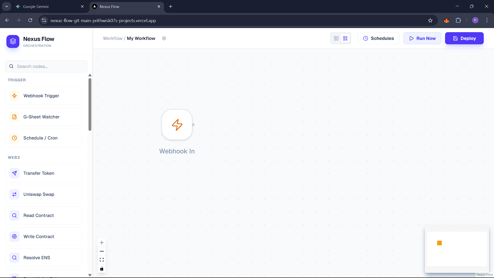
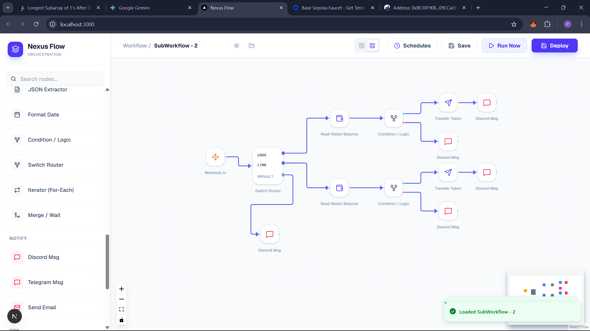
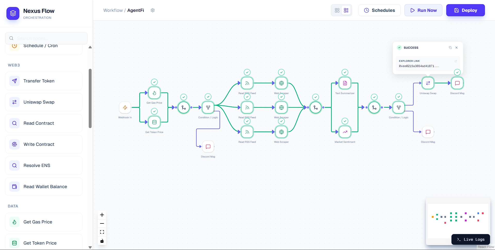
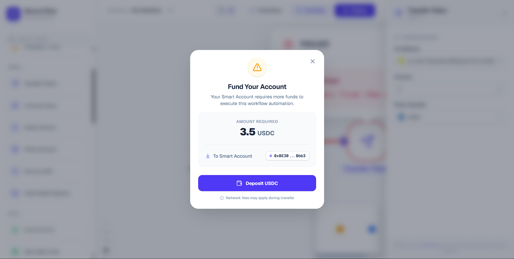

# Nexus Flow

A modular visual workflow automation platform built with a React/Next.js frontend and a TypeScript/Node backend.

This repository contains a browser-based workflow builder, an Express API service, and a BullMQ worker process. Redis is used for workflow state, event publishing, and queue coordination.

## Table of Contents

- [Project Overview](#project-overview)
- [Features](#features)
- [Architecture](#architecture)
- [Tech Stack](#tech-stack)
- [Directory Layout](#directory-layout)
- [Requirements](#requirements)
- [Environment Variables](#environment-variables)
- [Setup](#setup)
- [Run Commands](#run-commands)
- [Development Workflow](#development-workflow)
- [Service Details](#service-details)
- [Troubleshooting](#troubleshooting)
- [Notes](#notes)

## Project Overview

This project is a workflow automation system that lets users design, deploy, and run custom workflows visually.



- Provides a Next.js UI for designing node-based automation flows.
- Uses an Express API server for deployment, webhook handling, schedule orchestration, and runtime lifecycle control.
- Executes workflow jobs in a BullMQ worker process.
- Uses Redis for workflow persistence, pub/sub events, and queue coordination.
- Includes Web3, AI, data, notification, and logic node capabilities.

## Features

- Drag-and-drop workflow canvas with reusable nodes
- Undo/redo support for flow editing
- Live execution updates via Socket.IO and Redis pub/sub
- Webhook and timer-based workflow triggers
- Web3 actions: contract reads, writes, swaps, transfers, Aave operations, gas price, wallet balance
- AI actions: Gemini prompt, summarization, sentiment analysis, decisioning
- Data actions: HTTP requests, web scraping, RSS feeds, JSON extraction, formatting, transformation
- Notifications: Discord, Telegram, email, Twilio voice alerts
- Logic and control: condition rules, switch router, parallel branches, iterator loops
- Runtime memory persistence, pause/resume, and workflow hot reload support

## Sample Workflows

Switch Branched WorkFlows



Smart Agent WorkFlows



Wallet Funding



## Architecture

The system is split into three main layers:

1. `frontend/`
   - Next.js 16 application serving the UI on `http://localhost:3000`.
   - Manages workflow editing, node configuration, and live status updates.

2. `server/`
   - Express API server exposing deployment, webhook, schedule, and workflow control endpoints.
   - Bridges Redis pub/sub events to Socket.IO.

3. `server/worker.ts`
   - BullMQ worker that consumes workflow execution jobs.
   - Runs actions from the node registry and emits real-time workflow progress.

### Runtime coordination

- Redis stores workflow configs, pause/resume state, saved workflows, and repeatable schedule metadata.
- BullMQ uses Redis for queueing jobs and managing repeatable timers.
- Socket.IO delivers live node status and workflow updates back to the frontend.

## Tech Stack

- Frontend: Next.js 16, React 19, React Flow, Tailwind CSS, Sonner, Socket.IO client
- Backend: Node.js, Express 5, TypeScript, BullMQ, Redis, Socket.IO server
- Web3: Viem, Permissionless, Aave, Uniswap, ENS resolution
- AI: Google Generative AI via `@google/generative-ai`
- Notifications: Nodemailer, Twilio, Discord, Telegram
- Data: Cheerio, RSS parser, HTTP request workflows

## Directory Layout

- `frontend/` — Next.js UI application
  - `src/app/page.tsx` — main workflow canvas page
  - `src/components/` — flow editor, modals, logs, settings
  - `src/hooks/` — deployment and undo/redo helpers
  - `src/lib/` — node configuration and helpers
- `server/` — backend API and worker
  - `src/api/server.ts` — Express + Socket.IO API server
  - `src/worker.ts` — BullMQ worker entrypoint
  - `src/queue/workflowQueue.ts` — queue definitions
  - `src/config/redis.ts` and `redisPublisher.ts` — Redis connections
  - `src/engine/` — workflow engine, logic, variable resolver, helpers
  - `src/engine/nodes/` — individual node implementations
- `res/` — project screenshots and visual assets

## Requirements

- Node.js 20+ (recommended)
- npm
- Redis instance
- Optional: Google service account JSON for Google Sheets integration

## Environment Variables

Create a `.env` file inside `server/` or configure these variables in your runtime environment.

```env
PORT=3001

# Redis configuration
REDIS_URL=redis://localhost:6379
# or
REDIS_HOST=localhost
REDIS_PORT=6379

# Frontend API target
NEXT_PUBLIC_API_URL=http://localhost:3001

# Webhook base URL
RENDER_EXTERNAL_URL=http://localhost:3001
PUBLIC_URL=http://localhost:3001

# Blockchain / Web3
RPC_URL=<your_rpc_provider>
MASTER_KEY=<your_master_key>
PIMLICO_API_KEY=<your_pimlico_key>

# AI
GEMINI_API_KEY=<your_google_generative_api_key>

# Twilio
TWILIO_ACCOUNT_SID=<twilio_sid>
TWILIO_AUTH_TOKEN=<twilio_token>
TWILIO_PHONE_NUMBER=<twilio_from_number>
USER_PHONE_NUMBER=<phone_number_to_notify>
```

> The backend also references `server/src/google-service-account.json` for Google Sheets access. Replace it with your own service account file if required.

## Setup

1. Clone the repository:

```bash
git clone <repository-url> nexus-flow
cd nexus-flow
```

2. Install dependencies:

```bash
cd frontend && npm install
cd ../server && npm install
```

3. Create `server/.env` and set Redis and API credentials.

4. Start Redis locally or use a hosted Redis instance configured by `REDIS_URL`.

## Run Commands

### Start backend API

```bash
cd d:/nexus-flow/server
npm run dev
```

### Start worker process

```bash
cd d:/nexus-flow/server
npm run worker
```

### Start frontend

```bash
cd d:/nexus-flow/frontend
npm run dev
```

### Build frontend for production

```bash
cd d:/nexus-flow/frontend
npm run build
```

### Start frontend production server

```bash
cd d:/nexus-flow/frontend
npm run start
```

## Development Workflow

1. Start Redis.
2. Start the backend API server.
3. Start the BullMQ worker.
4. Start the frontend.
5. Open `http://localhost:3000`.
6. Use the UI to save, deploy, test, or trigger workflows.

## Service Details

### Frontend

- Folder: `frontend`
- Runs on: `http://localhost:3000`
- Responsibilities:
  - Render the workflow canvas
  - Manage nodes, edges, and workflow state
  - Send workflow deploy/test requests to the API
  - Subscribe to live execution events

### Backend API

- Folder: `server`
- Runs on: `http://localhost:3001`
- Responsibilities:
  - Accept workflow deployments and test executions
  - Create webhook endpoints for deployed workflows
  - Manage hot reload updates and schedule metadata
  - Save/load workflow definitions in Redis

### Worker

- Folder: `server`
- Entry point: `server/src/worker.ts`
- Responsibilities:
  - Consume `execute-workflow` jobs from BullMQ
  - Execute workflow action chains
  - Publish node-level progress and errors
  - Support resume-on-pause workflows

### API endpoints

- `POST /trigger-workflow`
- `POST /webhook/:workflowId`
- `PUT /hot-reload`
- `POST /test-node`
- `POST /resume-workflow`
- `GET /schedules`
- `DELETE /schedules/:key`
- `POST /api/workflows/save`
- `GET /api/workflows`
- `GET /api/workflows/:id`

## Troubleshooting

- If the frontend cannot connect to the backend, verify `NEXT_PUBLIC_API_URL` and that `server` is running.
- If workflow execution stalls, ensure Redis is reachable and the worker is running.
- If webhooks return 410 or 404, confirm the workflow has been deployed and the workflow ID is still active.
- If AI or Sheets nodes fail, verify the Google API credentials and the service account file.

## Notes

- This repository is intended for local development and experimentation.
- There is no Docker Compose configuration included in this repo.
- Do not commit `.env` secrets to source control.
- The primary app packages are `frontend/` and `server/`.

---

### Quick Start

```bash
cd d:/nexus-flow/frontend && npm install
cd ../server && npm install
# configure server/.env
cd ../server && npm run dev
cd ../server && npm run worker
cd ../frontend && npm run dev
```

Open `http://localhost:3000` in your browser.
